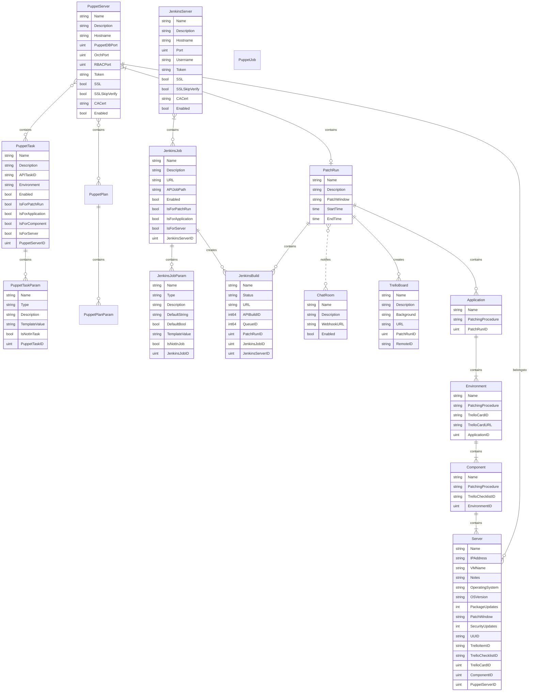

# Patching Automation Data Model

```mermaid
erDiagram

  PuppetServer }|--o| PatchRun : contains
  PuppetServer }o--o{ PuppetTask : contains
  PuppetServer }o--o{ PuppetPlan : contains

  PuppetTask ||--o{ PuppetTaskParam : contains
  PuppetPlan ||--o{ PuppetPlanParam : contains

  JenkinsServer }|--o{ JenkinsJob : contains
  JenkinsJob ||--o{ JenkinsJobParam : contains
  JenkinsJob ||--o{ JenkinsBuild : creates

  PatchRun ||--o{ JenkinsBuild : contains

  PatchRun }o..o{ ChatRoom : notifies

  PatchRun ||--o{ TrelloBoard : creates

  PatchRun ||--o{ Application : contains
  Application ||--|{ Environment : contains
  Environment ||--|{ Component : contains
  Component ||--|{ Server : contains

  PuppetServer ||--o{ Server : belongsto

  Application {
    string Name
    string PatchingProcedure
    uint PatchRunID
  }

  Component {
    string Name
    string PatchingProcedure
    string TrelloChecklistID
    uint EnvironmentID
  }

  Environment {
    string Name
    string PatchingProcedure
    string TrelloCardID
    string TrelloCardURL
    uint ApplicationID
  }

  ChatRoom {
    string Name
    string Description
    string WebhookURL
    bool Enabled
  }

  JenkinsBuild {
    string Name
    string Status
    string URL
    int64 APIBuildID
    int64 QueueID
    uint PatchRunID
    uint JenkinsJobID
    uint JenkinsServerID
  }

  JenkinsJob {
    string Name
    string Description
    string URL
    string APIJobPath
    bool Enabled
    bool IsForPatchRun
    bool IsForApplication
    bool IsForServer
    uint JenkinsServerID
  }

  JenkinsJobParam {
    string Name
    string Type
    string Description
    string DefaultString
    bool DefaultBool
    string TemplateValue
    bool IsNotInJob
    uint JenkinsJobID
  }

  JenkinsServer {
    string Name
    string Description
    string Hostname
    uint Port
    string Username
    string Token
    bool SSL
    bool SSLSkipVerify
    string CACert
    bool Enabled
  }

  PatchRun {
    string Name
    string Description
    string PatchWindow
    time StartTime
    time EndTime
  }

  PuppetServer {
    string Name
    string Description
    string Hostname
    uint PuppetDBPort
    uint OrchPort
    uint RBACPort
    string Token
    bool SSL
    bool SSLSkipVerify
    string CACert
    bool Enabled
  }

  PuppetTask {
    string Name
    string Description
    string APITaskID
    string Environment
    bool Enabled
    bool IsForPatchRun
    bool IsForApplication
    bool IsForComponent
    bool IsForServer
    uint PuppetServerID
  }

  PuppetTaskParam {
    string Name
    string Type
    string Description
    string TemplateValue
    bool IsNotInTask
    uint PuppetTaskID
  }

  PuppetPlan {}
  PuppetPlanParam {}

  PuppetJob{}

  Server {
    string Name
    string IPAddress
    string VMName
    string Notes
    string OperatingSystem
    string OSVersion
    int PackageUpdates
    string PatchWindow
    int SecurityUpdates
    string UUID
    string TrelloItemID
    string TrelloChecklistID
    uint TrelloCardID
    uint ComponentID
    uint PuppetServerID
  }

  TrelloBoard {
    string Name
    string Description
    string Background
    string URL
    uint PatchRunID
    string RemoteID
  }

```
